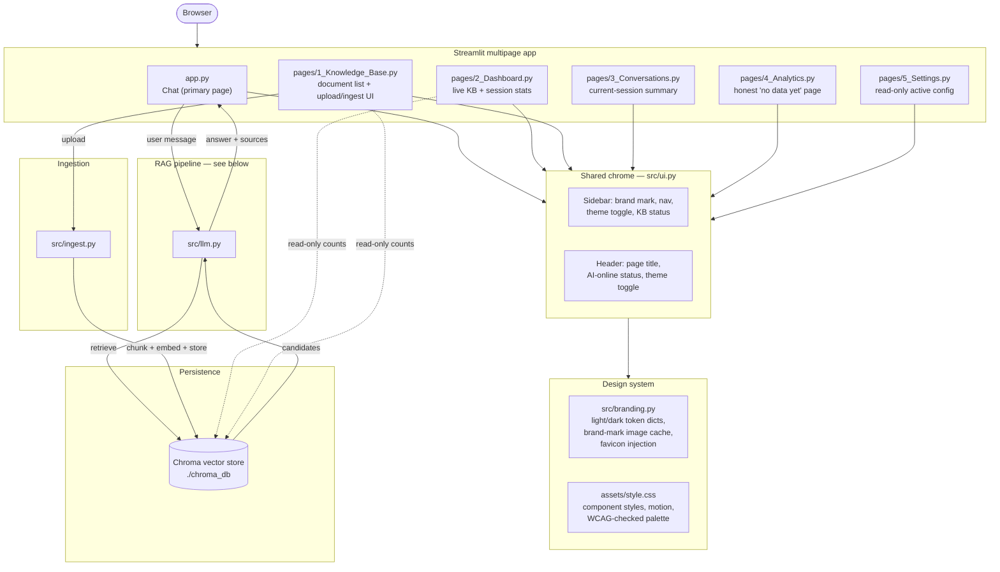
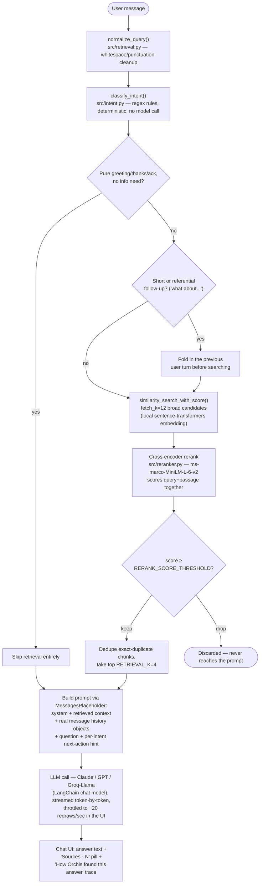

# Orchis — AI Customer Support Agent (RAG)

A retrieval-augmented generation (RAG) customer support agent that answers
questions grounded strictly in your own documentation (PDF/text/Markdown).
Built with LangChain, ChromaDB, a cross-encoder reranker, and a
deterministic intent router, with Claude (Anthropic), GPT (OpenAI), or Groq
(Llama) as the generation backend. If the knowledge base doesn't contain
relevant information — or the question is unrelated to the business
entirely — the agent says so instead of guessing or falling back on general
world knowledge.

Beyond the RAG pipeline itself, this repo is also a full product surface: a
custom blue/cyan design system with light/dark theming and WCAG-verified
contrast, a 6-page admin app (chat, dashboard, knowledge base management,
conversations, analytics, settings), and a security-audited upload/ingestion
path. The **Design system**, **Security**, and **Engineering approach**
sections below cover that work specifically — it's real, not decorative, and
each one documents an actual bug or vulnerability that was found, reproduced,
and fixed, not just a features list.

## Why this isn't just "prompt + vector search"

A minimal RAG demo embeds the query, does a nearest-neighbor lookup, and
stuffs the top-k chunks into a prompt. That's fast to build and breaks in
predictable ways: paraphrased questions miss because embeddings are blind to
wording differences, follow-up questions ("what about that?") retrieve
nothing because they're evaluated with no context, and greetings burn a
full retrieval pass for no reason. Orchis adds three deliberate layers on top
of that baseline to close those gaps:

1. **Deterministic intent routing** (`src/intent.py`) — regex-based, no
   model call. Classifies each message (ordering, shipping, returns,
   cancellation, escalation, etc.) to decide whether retrieval is even
   needed and what next-best-action guidance to hand the generation step.
   Pure greetings/acknowledgments skip retrieval entirely.
2. **Cross-encoder reranking** (`src/reranker.py`) — a bi-encoder embedding
   search alone ranks "How can I order?" far from "purchase products through
   our online store" because they share almost no vocabulary. A local
   `cross-encoder/ms-marco-MiniLM-L-6-v2` model rescoring the top candidates
   catches that kind of semantic match, and its score (not the raw distance)
   is what actually gates relevance.
3. **Follow-up query expansion** (`src/retrieval.py`) — short or
   referential queries ("what about international?", "how long does that
   take?") get the previous user turn folded into the search query before
   embedding, so retrieval isn't done blind to conversation context.

## Architecture

Two diagrams, because "how this works" is really two separate systems that
share a vector store: the **app shell** (a Streamlit multipage app with one
chat surface and four admin/observability pages, all sharing one chrome
module and one design-token system), and the **RAG request pipeline** that
runs on every chat message. Both are drawn from the code as it actually
runs today, not as a simplified sketch.

### App shell



Every page calls `render_sidebar()`/`render_header()` from `src/ui.py`
rather than drawing its own chrome, and every page's colors come from the
same light/dark token dictionaries in `src/branding.py` — there's exactly
one design system, not five pages that happen to look similar.

### RAG request pipeline

Runs once per chat message (`src/llm.py::_run_pipeline`, called from both
the streaming and non-streaming entry points):



**Key design decision:** the LLM is always called — retrieval only decides
what context it sees. Hallucination is prevented by grounding instructions
in the system prompt (never invent a policy, price, or order status; never
answer an off-topic question from general knowledge just because the model
happens to know it) rather than by hard-blocking the call on zero retrieval
hits, so a greeting or a vague "I need help" with no matching chunks still
gets a real, helpful reply instead of a canned refusal.

History is threaded into the prompt as real `HumanMessage`/`AIMessage`
objects via LangChain's `MessagesPlaceholder`, not as raw `(role, content)`
template strings — the latter treats any `{`/`}` in a past message's actual
content (a price, pasted JSON, anything) as a template variable and crashes
prompt construction on the next turn.

## Design system

The palette is 4 fixed brand colors — primary blue `#2563EB`, AI cyan
`#06B6D4`, deep navy `#0F172A`, light blue `#E0F2FE` — exposed verbatim as
`--color-*` custom properties, with a real tint/shade scale generated off
them per theme for backgrounds, surfaces, borders, and text rather than the
4 raw values used directly. Every pairing that can carry text was checked
against WCAG AA with an actual relative-luminance contrast calculation
(`src/branding.py`'s module docstring has the numbers), not eyeballed — one
concrete thing that check caught: raw AI cyan fails AA as small-text/icon
foreground on light surfaces (2.1–2.4:1), so it's split into `--ai-accent`
(decorative glow/ring use only) and a separate darker, text-safe
`--ai-accent-text` (`#0E7490`, 4.7–5.4:1) for anything that actually needs
to read as a foreground indicator — typing dots, the processing icon, the
RAG pipeline's step dots.

**Visual language: flat cards, not neumorphism.** Every card is a solid
fill (`--surface-neu`: white in light mode, `#172033` in dark) separated
from the page background by a real hairline border plus a single soft,
low-opacity drop shadow — restrained "premium SaaS" chrome rather than the
project's earlier embossed neumorphic surfaces (same-color card + matched
light/dark shadow pair standing in for a border). The AI message bubble
gets its own distinct fill (`--ai-surface`: light blue in light mode, the
same elevated navy as other cards in dark mode) so it reads as a
purpose-built AI surface rather than a generic card. A very subtle, static
radial-gradient wash in the brand blue (upper-right) and cyan (lower-left)
sits behind the page as ambient lighting — large blur, low opacity, no
motion — rather than a visible decorative blob.

Typography pairs a geometric sans (Space Grotesk, standing in for Futura —
not web-licensed here — on the "Orchis" wordmark and headings) with Inter
for body/UI text (standing in for Proxima Nova), plus Playfair Display used
sparingly as an italic accent (standing in for Luxomona) on the tagline
only, on a 12/14/16/20/24/32 type scale with tightening letter-spacing on
larger sizes. Motion is transform/opacity only everywhere (never
`width`/`height`/`top`/`left`, which forces layout instead of just
compositing a GPU layer) — entrances are `ease-out`, `prefers-reduced-motion`
is respected globally, and CSS-only animations do real work rather than
decorate: an accordion expands via a `grid-template-rows` transition instead
of an instant `display:none` snap, and a "Processing" badge only pulses
while a document is genuinely mid-index, never as a fixed decoration.

Two non-obvious, real bugs came out of building this system, both found by
inspecting the live DOM rather than assumed from documentation:

- The theme toggle (`st.toggle`) renders with `data-testid="stCheckbox"` in
  the Streamlit version this app pins, not the plausible-looking
  `"stToggle"` — every recolor/centering rule targeted a testid that didn't
  exist anywhere in the DOM, so the control silently rendered at Streamlit's
  untouched default the whole time. Fixed once the real selector was
  confirmed against the live page.
- A `<div class="nav-group">` opened and closed across separate
  `st.markdown()` calls with widgets rendered in between doesn't actually
  wrap those widgets — each call produces an independent sibling node in
  Streamlit's real DOM, not nested children of whatever the previous
  string happened to open. `document.querySelectorAll('.nav-group')[0]
  .children.length` was `0`. Sidebar grouping now goes through a real
  `st.container(key=...)`, which Streamlit exposes as an `st-key-<key>`
  class on a genuine wrapper element.

## Security

Found and fixed during a dedicated audit pass, each reproduced before being
called a bug:

- **Path traversal → RCE in the Knowledge Base upload handler.**
  `st.file_uploader`'s `type=` filter is client-side only; the filename in
  an upload is attacker-controlled, and `DOCS_DIR / uploaded_file.name`
  resolves a name like `../../app.py` outside the docs directory — on this
  app, overwriting `app.py` is remote code execution, since Streamlit
  re-executes that file on every rerun. `pages/1_Knowledge_Base.py` now
  validates fail-closed: basename-only (after normalizing `\` to `/`, so a
  Windows-style `..\..\app.py` is caught the same way), an extension
  allowlist, and a final re-resolve that requires the path's parent to
  still be `DOCS_DIR` — a backstop that holds even if the first two checks
  ever miss a form. Verified against 14 hostile filenames.
- **Unbounded upload size.** No cap existed; every accepted byte ran
  through the local embedding model. Capped at 10MB both in
  `.streamlit/config.toml` (`maxUploadSize`, which only bounds what the
  server *accepts*) and again in Python (`MAX_UPLOAD_BYTES`, which is what
  the page actually *enforces*).
- **Stored HTML injection + a copy button that silently never worked.**
  The chat "Copy" button's `onclick` payload wasn't HTML-escaped, and
  Streamlit's markdown renderer has no sanitizer — a knowledge-base
  document containing a stray `"` could break out of the attribute. It also
  never worked as a button: a string-valued `onClick` is dropped silently
  by React. Rebuilt with a properly escaped `data-*` attribute and a real
  delegated click handler.
- Several `.env`-derived values (active model name, provider, embedding
  model) rendered into `unsafe_allow_html` blocks unescaped — low risk
  since that's operator-controlled config, not user input, but fixed as
  defense in depth so no interpolated value in the app is unescaped.

**Known, deliberately unaddressed gap:** there's no auth or rate limiting in
front of the app. Anyone who can reach it can spend LLM quota one message at
a time, and the Knowledge Base page lets any visitor write to the corpus the
agent answers from. That's a deployment decision (auth in front of
Streamlit vs. per-session throttling) rather than something to pick
unilaterally, but it's the largest remaining gap before a public deployment.

## Engineering approach

Every fix in this repo follows the same rule: **no fix without a reproduced
root cause and a regression check that proves it.** Concretely, that meant
two verification paths used throughout, not just at the end:

- **Streamlit's `AppTest` framework** (`streamlit.testing.v1`) for
  logic-level regression checks — it actually executes the app's Python
  (not a mock), so a sweep like "load every page, send a chat message,
  toggle dark mode, switch pages, assert no exception" catches real bugs
  Python-only testing can't: a prompt-template crash that only appears on
  a message containing `{}` after a second turn, a document re-upload that
  left duplicate chunks in the vector store, a "Regenerate" button that
  appended instead of replacing a turn.
- **Live browser inspection** for anything CSS/DOM-shaped, where reasoning
  from the stylesheet alone repeatedly turned out to be wrong. Three
  examples that only surfaced this way: the sidebar's own `stCheckbox` vs
  `stToggle` testid mismatch above; an `.stApp` that measured
  `height: 0` via `getBoundingClientRect()` after removing a
  `position: relative` rule Streamlit's own internal layout turned out to
  depend on (children still had correct geometry — they were just clipped
  into an invisible 0px scroll viewport); and ~124px of dead space stacked
  above the sidebar logo from three separate padding rules compounding
  without any single one being "wrong" on its own.

The throughline: a plausible-sounding explanation ("this selector should
match," "this padding looks reasonable") was treated as a hypothesis to
verify against the actual running app, not a conclusion — most of the real
bugs listed in this README were invisible from reading the code and only
became obvious once actually reproduced.

## Project structure

```
.
├── app.py                       # Streamlit chat interface (primary page)
├── pages/
│   ├── 1_Knowledge_Base.py       # Live KB status, document list, upload/ingest UI
│   ├── 2_Dashboard.py             # Live KB + this-session stats, active model config
│   ├── 3_Conversations.py          # Honest current-session-only conversation summary
│   ├── 4_Analytics.py               # States plainly there's no cross-session data yet
│   └── 5_Settings.py                 # Read-only view of the real active .env config
├── requirements.txt
├── .env.example                   # copy to .env and fill in your keys
├── .streamlit/config.toml          # Streamlit's own native theme + server config
├── data/docs/                       # put your PDF/TXT/MD source documents here
├── chroma_db/                        # persisted vector store (created on ingest)
├── assets/
│   ├── style.css                      # design tokens' consumer: all component CSS
│   ├── orchis-mark.png                 # the brand mark, source for every rendered size
│   └── favicon/                         # generated favicon set (16/32/48/180/192/512 + .ico)
└── src/
    ├── config.py                    # settings loaded from .env
    ├── embeddings.py                 # shared embedding function
    ├── ingest.py                      # CLI + UI-callable: load, chunk, embed, store
    ├── intent.py                       # deterministic intent routing (no model call)
    ├── retrieval.py                     # candidate search + follow-up expansion + dedupe
    ├── reranker.py                       # cross-encoder relevance scoring
    ├── llm.py                             # provider setup + agent pipeline + streaming
    ├── ui.py                               # shared sidebar/header chrome for every page
    └── branding.py                          # light/dark theme tokens, brand mark, favicon
```

## Setup

### 1. Install dependencies

```bash
python -m venv venv
venv\Scripts\activate        # Windows
# source venv/bin/activate   # macOS/Linux

pip install -r requirements.txt
```

### 2. Configure environment variables

```bash
copy .env.example .env        # Windows
# cp .env.example .env        # macOS/Linux
```

Edit `.env`:

- Set `LLM_PROVIDER` to `anthropic`, `openai`, or `groq`.
- Fill in `ANTHROPIC_API_KEY` (https://console.anthropic.com), `OPENAI_API_KEY`
  (https://platform.openai.com), or `GROQ_API_KEY`, matching your chosen provider.
  Groq is the only one with a genuinely free tier — no card required, get a key
  at https://console.groq.com/keys.
- Defaults are otherwise sensible for local development. Embeddings and the
  reranker both run locally via `sentence-transformers` — no extra API key
  needed for either.

### 3. Add your documents

Drop PDF, `.txt`, or `.md` files into `data/docs/`. Six sample support docs
for a demo e-commerce brand ("Acme Widgets" — fictional, clearly labeled as
demo content) are already included so you can try the app immediately.

### 4. Ingest documents into the vector store

```bash
python -m src.ingest
```

Re-run with `--reset` to wipe and rebuild the collection from scratch, e.g.
after editing source documents:

```bash
python -m src.ingest --reset
```

You can also add and index documents from the running app itself — see
**App pages → Knowledge Base** below.

### 5. Run the chat app

```bash
streamlit run app.py
```

Open the URL Streamlit prints (usually http://localhost:8501).

## App pages

The app is a Streamlit multipage app: the main page is the chat, and five
more pages live in the sidebar nav. Every number shown anywhere in the app
is read live from Chroma, the filesystem, or `.env` — none of it is
fabricated, and pages say so explicitly where there's genuinely no data yet
(Analytics) rather than inventing a metric.

- **Chat** (`app.py`) — the primary page. Streamed answers, a "Sources · N"
  pill, a "How Orchis found this answer" trace panel, regenerate/feedback
  controls, and a dev-only verbose debug expander behind `DEBUG_MODE`.
- **Knowledge Base** — live admin view of the vector store: document count,
  indexed count, and total chunk count read live; per-document status
  (Indexed / Processing / Failed, with the real error if a file failed to
  load); an upload panel that saves new files to `data/docs/` and runs the
  same `ingest()` function the CLI uses, restricted to just the uploaded
  files so re-indexing replaces a document's old chunks instead of
  duplicating them.
- **Dashboard** — the same live KB counts plus this session's real message/
  feedback totals and the active model configuration.
- **Conversations** — an honest single-conversation view (chat history is
  session-only, not persisted — see Notes below).
- **Analytics** — states plainly that there's no cross-session event log to
  chart yet, and what would need to exist for this page to show real data.
- **Settings** — read-only view of the actual active `.env` configuration
  for this running process. API keys are never read or displayed, not even
  redacted.

Every page shares one sidebar/header chrome (`src/ui.py`) and one light/dark
design-token system (`src/branding.py` + `assets/style.css`) — including a
theme toggle that persists across page navigation via session state, with a
`?theme=` URL fallback for a fresh page load.

## Example queries

Using the included sample docs:

- "How long does standard shipping take?"
- "Can I return a sale item?"
- "What payment methods do you accept?"
- "How can I get my money back?" (paraphrase — the reranker matches this to
  the return/refund policy even though it shares little vocabulary with it)
- "How long does that take?" (as a follow-up — resolved using the prior turn)

Try an out-of-scope question to see the grounding guarantee in action:

- "Can you help me plan a vacation to Bali?"
- "What's your policy on cryptocurrency payments?"

## Configuration reference (.env)

| Variable | Default | Description |
|---|---|---|
| `LLM_PROVIDER` | `anthropic` | `anthropic`, `openai`, or `groq` |
| `ANTHROPIC_API_KEY` | — | Required if using Anthropic |
| `ANTHROPIC_MODEL` | `claude-opus-5` | Any current Claude model ID |
| `OPENAI_API_KEY` | — | Required if using OpenAI |
| `OPENAI_MODEL` | `gpt-4o-mini` | Any OpenAI chat model |
| `GROQ_API_KEY` | — | Required if using Groq (free, no billing) |
| `GROQ_MODEL` | `llama-3.3-70b-versatile` | Any Groq-hosted model |
| `CHROMA_PERSIST_DIR` | `./chroma_db` | Where the vector store is saved |
| `COLLECTION_NAME` | `support_docs` | Chroma collection name |
| `EMBEDDING_MODEL` | `sentence-transformers/all-MiniLM-L6-v2` | Local embedding model |
| `RETRIEVAL_K` | `4` | Chunks handed to the LLM as final context |
| `FETCH_K` | `12` | Broader candidate pool pulled before reranking |
| `RERANK_SCORE_THRESHOLD` | `-8.0` | Cross-encoder relevance gate (raw logit scale, roughly -11..+11) |
| `CHUNK_SIZE` | `500` | Characters per chunk during ingestion |
| `CHUNK_OVERLAP` | `75` | Overlap between adjacent chunks |
| `DEBUG_MODE` | `false` | Shows a dev-only "Agent debug" panel per turn: classified intent, search query, and per-candidate rerank/distance scores. Never shown to end users when off. |

### Tuning relevance

`RERANK_SCORE_THRESHOLD` is what actually decides whether a retrieved chunk
counts as relevant — it's applied to the cross-encoder's score, not the raw
embedding distance. If the agent is answering questions it shouldn't
(hallucinating from weak matches), raise the threshold. If it's saying a
topic isn't covered when it should be able to answer, lower it slightly and
re-test with `DEBUG_MODE=true` to see the actual candidate scores.

## Notes

- Vector embeddings and reranking both run locally (no API cost, no data
  sent to a third party) — only the final generation step calls the LLM API.
- Switching `EMBEDDING_MODEL` after documents are already ingested requires
  re-running `python -m src.ingest --reset`, since old vectors are not
  compatible with a different embedding model.
- This app keeps chat history in Streamlit session state only (not
  persisted); refreshing the page starts a new conversation.
- Orchis has no tools connected to any real backend (no order lookup, no
  payment/refund processing). It's explicit about this: for any request to
  actually perform an action, it states plainly that it can't, then explains
  the real, documented way to do it.
- First page load on a fresh process takes ~15-20s before anything renders
  — the local embedding model (`sentence-transformers`) loads synchronously
  on the first call into the vector store, and a "Starting Orchis..."
  spinner covers that wait. It's a one-time cost per process, not per
  request (the model is cached for the process's lifetime).
- `.streamlit/config.toml` disables Streamlit's dev file-watcher on
  purpose — walking `sentence-transformers`'/`transformers`' hundreds of
  lazy-loaded submodules on every file save made the UI feel frozen during
  streaming. Restart the server manually after editing source files.
- Uploaded document size is capped at 10MB per file (see **Security**
  above) — increase `maxUploadSize` in `.streamlit/config.toml` and
  `MAX_UPLOAD_BYTES` in `pages/1_Knowledge_Base.py` together if you need
  larger source documents; both must move in step, since either one alone
  only enforces half the limit.
